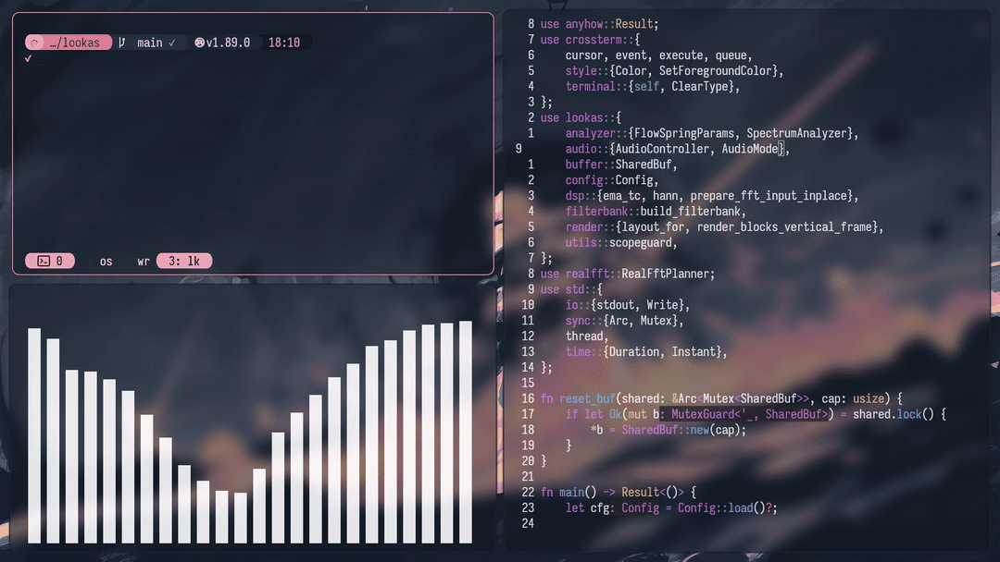

# lookas

<p align="center">
    
</p>


## What 

This is an ultra-lightweight terminal audio visualizer for Linux. 

It captures audio (microphone input, system, or both), and translates sound into smooth, physics driven bars. 

Sound is rendered the way humans actually perceive it, not like a 90s disco strobe.

Quite different from others you may know like CAVA. It uses a different set of algorithms entirely (which I'll break down below).

## Why 

On my machine, workspace 3 is basically all terminals (as you can see in the demo).

Each window can hold about six or seven tmux panes.

One window is for terminal work, the other is Neovim.

The problem is I use a window manager, so with only two windows, they each spread out to take up half the screen, way bigger than they need to be.

If I just split the screen into two horizontal blocks, it looks ugly: you get the editor and one huge horizontal terminal doing absolutely nothing.

So I added a third terminal to even things out and make the layout look right.

When I'm in Neovim, I hit `Ctrl+F` to expand it to full screen. But when I go back, that third terminal is still just sitting there, empty.

Now, I always have music or some kind of sound playing for deep focused work, so I figured, why not put a visualizer in that space instead of leaving it dead?

CAVA is probably the most well known option, but it's too twitchy, jarring, and visually noisy. It doesn't look smooth no matter how much you tweak it.

This solves that problem, plus it's written in Rust, and it's more performant too.

Speaking of which:

## How it works & performance

The program is extremely lightweight.

It takes up practically nothing, running at ~3.8 MB of RAM and ~1.25% of a single CPU core.

Compared to CAVA, which is around 16 MB of RAM and 5.5% CPU, this is roughly 4x lighter on both memory and processor usage.

So, how does it work?

The entire DSP and render pipeline is strictly zero-allocation in the hot path. Every audio ring buffer, FFT state array, and terminal character vector is sized and allocated exactly once when the program starts.

The program starts a loop, during the loop, it tuns at 60 fps, and it just mutates those existing slices in place.

Since memory is never reallocated inside the loop, there's no overhead or fragmentation.

And for the visuals, it builds the entire frame inside a single pre-allocated byte buffer and flushes it to a 1MB `BufWriter<T>` in one contiguous chunk.

This removes terminal I/O bottlenecks and eliminates screen flickering.

Older Lookas versions used to flicker on tmux and Electron-based terminal emulators. Not anymore.

## CAVA Comparison

This table is a brief illustration over how both differ.


| Feature         | CAVA              | Lookas                   |
| :-------------- | :---------------- | :----------------------- |
| **Mapping**     | Logarithmic       | Mel-scale                |
| **Dynamics**    | Autosens / Manual | Percentile tracking      |
| **Noise**       | Basic reduction   | Explicit noise gate      |
| **Balance**     | Per-bar EQ        | A-weighting              |
| **Smoothing**   | Quadratic gravity | Asymmetric EMA           |
| **Physics**     | Gravity fall-off  | Spring-damper system     |
| **Interaction** | None              | Lateral energy diffusion |


## Installation

Simply run:

```bash
cargo install lookas
```

Or install directly from source

```bash
cargo install --git https://github.com/rccyx/lookas.git
```

Dependencies are quite minimal (`cpal` for audio, `crossterm` for UI, `realfft` for the math). 

If your Linux setup already has working audio, cargo will install these and it will just run.

> [!IMPORTANT]
> If you are on a barebones or minimal Linux install (like a raw Arch or Debian base) and the program fails to capture audio, you might just be missing the basic system audio headers. So run:
>
> ```bash
> sudo apt install -y libasound2-dev pulseaudio-utils
> ```
>
> This works for both PulseAudio and PipeWire systems (via `pipewire-pulse`).

## Usage

Just run:

```bash
lookas
```

That's it.

It automatically attempts to grab system audio (the desktop loopback). If that's not available, it safely falls back to the microphone.

While running, you can press:

- `1` – Microphone input
- `2` – System audio (loopback / monitor)
- `3` – Microphone + system mix
- `r` – Restart audio pipeline
- `q` – Quit

## Configuration

This all optional. You don't need a config file. 

The default physics and smoothing values are already tuned for the fluid motion you see in the demo.

But, if you want to tweak some things (colors, cap the frequency range, spring physics) you can drop a config file here `~/.config/lookas.toml`:

```toml
color = "#7CCEA7"

fmin = 30.0
fmax = 16000.0
frame_ms = 16
fft_size = 2048
tau_spec = 0.06
gate_db = -65.0
flow_k = 0.18
spr_k = 60.0
spr_zeta = 1.0
```

> [!NOTE]
> Every setting is optional. Any omitted value uses the built-in default.

Those config keys may not be super intuitive, so let me explain the algorithms used here first:

#### Mel scale

Raw FFT gives raw frequency bins spaced evenly/linearly, this is how CAVA works. Without mel scale, grouping those bins into bars linearly (or even logarithmically) still doesn't quite match how human pitch perception actually works. Mel scale groups them the way your ear resolves pitch differences, so bar spacing feels natural instead of bunching up too much at one end.

#### A-weighting

A quiet high-pitched hiss and a bass note can carry similar raw energy but sound completely different in volume to a human ear. Without A-weighting, bars just reflect raw signal strength, which makes bass frequencies look artificially dominant and highs look lighter than they actually sound. A-weighting rebalances each bar using the same curve sound level meters use, so bar height reflects how loud something sounds.

#### Attack/release envelope (`tau_spec`)

Audio energy jumps around constantly, frame to frame. Without any smoothing, bars would flicker and jitter nonstop, smoothing everything equally, though, would dull sharp hits like snares and kicks, which makes it feel laggy. This is why bars snap up instantly on a hit but fade out gradually afterward. This is the smae instant-attack, slow-release principle used in compressors and VU meters.

#### Noise gate (`gate_db`)

Microphones and even system audio pick up faint background noise (room hiss, hum, etc) silence that isn't perfectly zero. Without a gate, bars would twitch and flicker even when nothing is actually playing. The gate sets a threshold, anything quieter than that is treated as silence and the bars drop to zero, instead of jittering on noise floor.

#### Diffusion (`flow_k`)

Without diffusion, every bar reacts only to its own frequency band, completely independent of its neighbors. That looks choppy and disconnected, more like a bunch of separate spikes than one cohesive shape. Diffusion lets each bar's motion bleed slightly into the bars next to it, so energy looks like it's flowing across the spectrum instead of popping up in isolated columns.

#### Spring-damper motion (`spr_k`, `spr_zeta`)

Without physics-based motion, bars would either snap instantly to their target value (looks robotic and harsh) or fall off in a straight line like basic gravity (looks stiff and mechanical). A spring-damper model moves each bar toward its target the way a real spring settles, smooth acceleration in, smooth settle at the end, which is what makes the motion feel alive instead of animated.

### Color

The hex color code for the foreground bars.

It accepts a 6 digit RGB hex color with or without the leading `#`:

```toml
color = "#7CCEA7"
```

```toml
color = "7CCEA7"
```

The default is white:

```toml
color = "#FFFFFF"
```

### Frequency Boundaries (fmin & fmax)

The lowest and highest frequencies rendered by the visualizer, measured in Hertz.

`fmin` defaults to `30.0` and is restricted to `10.0` through `1000.0`.

`fmax` defaults to `16000.0` and is restricted to `1000.0` through `24000.0`.

Why change this? 

If you set fmax too high (like 24,000Hz) and your audio source contains very little high-frequency energy, you'll just end up with dead or empty bars on the right side of your terminal.

### Spectrum Resolution (fft_size)


Controls the number of samples processed by each Fast Fourier Transform window.

Defaults to 2048 (restricted to 512 through 4096).

- Lower values (512, 1024) make the visualizer react faster but give you less frequency detail.

- Higher values (4096) give you much finer bin separation, at the cost of additional latency and processing work.


### Frame Pacing (frame_ms)

The target duration of each rendered frame in milliseconds. Defaults to 16 (targets ~60 FPS). Bounded between 8 and 50.

Drop it to 8 if you want 120 FPS and your terminal throughput can handle it.

Bump it to 32 if you want to save even more CPU.


### Spectrum Smoothing (tau_spec)

Controls how quickly the spectrum energy decays after a transient. Defaults to 0.06 (restricted to 0.01 through 0.20).

Notice this only affects the release. Attacks are always immediate so you never miss a sharp transient (like a snare hit). Lowering this value makes the bars decay faster, while raising it produces a longer visual tail.


It defaults to `0.06`


### Noise Gate (gate_db)

The silence threshold in decibels. Defaults to -65.0 (restricted to -80.0 through -30.0).


If you are using your microphone, it's going to pick up room noise and static. Dropping this threshold (e.g., -50.0) forces it to ignore that background hiss so the visualizer actually drops to absolute zero when you're not talking.


### Motion Coupling (flow_k)

This is what makes it look like a fluid. 

It dictates how strongly energy diffuses between neighboring bars. 

Defaults to 0.18 (restricted to 0.0 through 1.0).

If you set this to 0.0, every frequency band moves completely independently (which makes it look like standard CAVA). Higher values drag neighboring bars along for the ride.


### Spring-Damper Animation (spr_k & spr_zeta)


These control the physics of the bounce.


- spr_k (stiffness): Defaults to 60.0 (restricted to 10.0 through 200.0). Higher values make the bars snap back aggressively.

- spr_zeta (damping): Defaults to 1.0 (restricted to 0.1 through 2.0). A value of 1.0 is critically damped (smooth stop). 

You can drop it below 1.0 if you want the bars to overshoot and visually bounce. 

Go above 1.0 for a sluggish/heavy response.

## License

MIT © [@rccyx](https://rccyx.com)